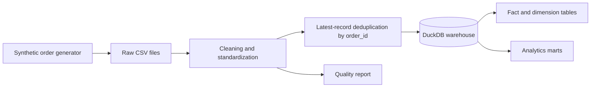

# Retail Sales ETL Pipeline

[](https://github.com/Aadil-Mansuri0/retail-sales-etl/actions/workflows/ci.yml)

End-to-end retail data engineering pipeline that turns raw CSV orders into a DuckDB warehouse, analytics marts and a machine-readable data-quality report.

## Why This Project Matters

This is a practical Data Engineering project, not a notebook-only analysis. It demonstrates ingestion, validation, transformations, idempotent loading, dimensional modelling, mart generation, reproducible local runs and CI-backed tests.

## Data Flow



## Engineering Highlights

- Generates reproducible sample retail order data.
- Extracts one or more raw CSV files from `data/raw/`.
- Validates required columns before transformation.
- Standardizes dates, numeric values, discounts, status and missing city/payment values.
- Drops invalid business records such as missing order IDs or non-positive amounts.
- Deduplicates by `order_id`, keeping the latest `updated_at` record.
- Loads into DuckDB with delete-and-insert upsert behavior for safe reruns.
- Builds `fact_sales`, dimensions and reporting marts.
- Exports marts to CSV under `data/processed/`.
- Writes `docs/quality_report.json` with row counts and quality check results.
- Runs automated tests and compile checks in GitHub Actions.

## Tech Stack

Python, Pandas, DuckDB, SQL, Pytest, GitHub Actions.

## Warehouse Model

Core warehouse tables:

- `fact_sales`
- `dim_product`
- `dim_customer`
- `dim_date`

Analytics marts:

- `mart_daily_revenue`
- `mart_top_products`
- `mart_city_performance`

## Repository Structure

```text
retail-sales-etl/
├── src/
│   ├── generate_data.py
│   └── etl_pipeline.py
├── tests/
│   ├── test_etl_pipeline.py
│   └── test_pipeline.py
├── .github/workflows/ci.yml
├── requirements.txt
└── README.md
```

Generated locally at runtime:

```text
data/raw/
data/processed/
warehouse/retail_warehouse.duckdb
docs/quality_report.json
```

## Run the Pipeline

```bash
python3 -m venv .venv
source .venv/bin/activate
pip install -r requirements.txt
python src/generate_data.py --rows 50000 --days 120
python src/etl_pipeline.py
```

Expected outputs:

- Cleaned order data: `data/processed/retail_orders_clean.csv`
- Analytics marts: `data/processed/mart_*.csv`
- Local warehouse: `warehouse/retail_warehouse.duckdb`
- Quality report: `docs/quality_report.json`

Generated outputs are local artifacts and are intentionally kept out of Git.

## Rerun Safety

The pipeline reads raw files on each run and replaces warehouse rows for matching `order_id` values before inserting the latest clean records. This prevents duplicate business keys across repeated executions.

## Data Quality Checks

The pipeline validates:

- transformed row count is greater than zero
- no null `order_id`
- no duplicate `order_id`
- no non-positive `order_amount`
- no future `order_date`
- discount remains between `0` and `0.9`

A failed quality report stops the run with a non-zero exit.

## CI

GitHub Actions runs on pushes and pull requests to `main` and:

1. Installs dependencies.
2. Compiles source and test modules.
3. Validates core imports.
4. Runs the automated transformation and data-quality tests with `pytest`.

## Portfolio Position

This should be treated as the primary Data Engineering project on the profile. It demonstrates a complete, reproducible batch pipeline with warehouse modelling and tests.

## Author

Aadil Mansuri - CSE (AI) student focused on ML, Data Engineering and backend systems.

[GitHub](https://github.com/Aadil-Mansuri0)
