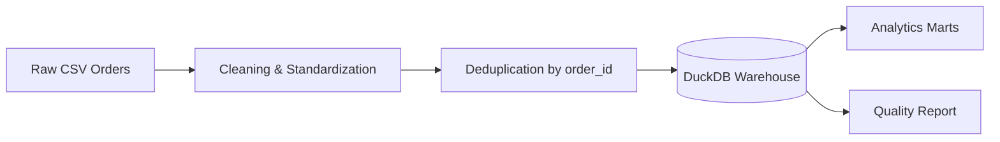

# 📊 Retail Sales ETL Pipeline

[](https://github.com/Aadil-Mansuri0/retail-sales-etl/actions/workflows/ci.yml)

> End-to-end retail data engineering pipeline that transforms raw CSV orders into a DuckDB warehouse, analytics marts and a machine-readable data-quality report.

## 🚀 Project Overview



## ✨ Engineering Highlights

- Extracts raw retail order files from `data/raw/`
- Standardizes data types and missing values
- Deduplicates records using the latest `updated_at`
- Uses idempotent upsert behavior for reruns
- Builds fact and dimension tables
- Publishes reporting marts for revenue, products and cities
- Produces a pipeline quality report
- Includes automated GitHub Actions validation and pytest tests

## 🛠️ Tech Stack

Python · Pandas · NumPy · DuckDB · SQL · Pytest · GitHub Actions

## 🗂️ Warehouse Model

- `fact_sales`
- `dim_product`
- `dim_customer`
- `dim_date`

### Analytics marts

- `mart_daily_revenue`
- `mart_top_products`
- `mart_city_performance`

## 📁 Repository Structure

```text
retail-sales-etl/
├── src/
│   ├── generate_data.py
│   └── etl_pipeline.py
├── tests/
│   └── test_pipeline.py
├── data/
│   ├── raw/
│   └── processed/
├── warehouse/
├── docs/
├── .github/workflows/ci.yml
├── requirements.txt
└── README.md
```

## ▶️ Run the Pipeline

```bash
python3 -m venv .venv
source .venv/bin/activate
pip install -r requirements.txt
python src/generate_data.py --rows 50000 --days 120
python src/etl_pipeline.py
```

Generated artifacts include cleaned data, analytics marts, a quality report and the local DuckDB warehouse. These generated files are intentionally kept out of Git when configured as local artifacts.

## 🔁 Rerun Safety

The pipeline reads raw files on each run and replaces warehouse rows for the same business key (`order_id`). This makes repeated executions safer and prevents duplicate business keys.

## 🧪 Quality & CI

GitHub Actions runs on pushes and pull requests to `main` and:

1. Installs project dependencies.
2. Compiles source and test modules.
3. Validates core imports.
4. Runs the automated transformation and data-quality tests with `pytest`.

## 📈 Portfolio Value

This project demonstrates practical data-engineering concepts rather than a notebook-only workflow: ingestion, transformation, warehouse modelling, idempotency and data-quality validation.

## 👨‍💻 Author

**Aadil Mansuri** — CSE (AI) student focused on ML, Data Engineering and backend systems.

[GitHub](https://github.com/Aadil-Mansuri0)
